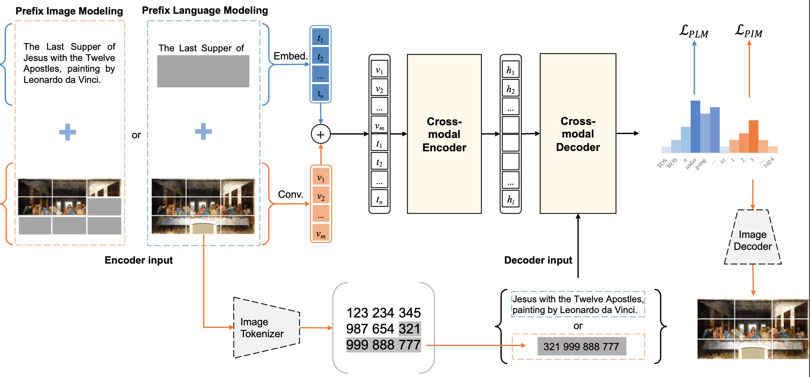

## Prefix Language Models are Unified Modal Learners

This is the official PyTorch implementation of the <a href="https://arxiv.org/abs/2206.07699">DaVinci paper</a>. 
This repository supports pre-training on custom datasets, as well as finetuning on (1) text understanding, (2) image understanding, (3) text-to-image generation, (4) image-to-text generation, (5) multi-modal understanding tasks.
Our implementation is built on the source code from <a href="https://github.com/salesforce/ALBEF">ALBEF</a>.



### Hiring
We are looking for interns / FTEs at ByteDance AI-LAB (in Beijing / Shanghai)! 
If you are interested in working with us on vision language models, please send your resume to zhangxinsong.0320@bytedance.com.

### Requirements:
- Install python3 environment
```angular2html
pip3 install -r requirements.txt
```
- Download raw images from corresponding websites
- Download the json files we provided, which contains image read paths and captions and/or bbox annotations
- If running pre-training scripts: 
  - install Apex
- Organize these files like this:  
```angular2html
DaVinci/
    data/
        coco_test.json
        coco_train.json
        coco_val.json
        *.json

    images/
        coco/
            train2014/*.jpg
            val2014/*.jpg
            test2015/*.jpg
        
        visualgenome/
            image/*.jpg
        
        nlvr2/
            images/
                train/0-99/*.png
            dev/*.png
            test1/*.png
```


### Pre-training on custom datasets:
1. Prepare pre-training data (json files) where each json file contains a list. Each item in the list is a dictonary with two key-value pairs: {'binary': bs64_encoding_of_the_image, 'caption': text_of_image}. 
2. In configs/Pretrain.yaml, set the paths for the json files.
3. Pre-train the model:
<pre>
    if [[ ${NUM_WORKER_GPU} > 1 ]];
    then
        python3 -m torch.distributed.launch --nproc_per_node=${NUM_WORKER_GPU}  \
            --nnodes=${NUM_WORKER} --node_rank=${RANK_ID} --master_addr=${WORKER_0_HOST} --master_port=${WORKER_0_PORT}\
            --use_env Pretrain.py \
            --config ./configs/Pretrain.yaml \
            --output_dir ./outputs/pretrain_coco_vg_${time} \
            --override_cfg "$override_cfg"
    else
        python3 -u Pretrain.py \
        --config ./configs/Pretrain.yaml \
        --output_dir ./outputs/pretrain_coco_vg_${time} --override_cfg "$override_cfg"
    fi
</pre>

### Multi-Modal Understanding 
#### VQA:
1. Download VQA v2 dataset and Visual Genome dataset from the original websites.
2. Download and extract the provided dataset json files.
3. In configs/VQA.yaml, set the paths for the json files and the image paths.
4. Finetune the pre-trained checkpoint using 8 A100 GPUs:
<pre>python -m torch.distributed.launch --nproc_per_node=8 --use_env VQA.py \
--config ./configs/VQA.yaml \
--output_dir output/vqa \
--checkpoint [Pretrained checkpoint]</pre> 
5. Evaluate the result using the official evaluation server.

#### Visual Entailment:
1. Download SNLI-VE dataset from the original website.
2. Download and extract the provided dataset json files.
3. In configs/VE.yaml, set the paths for the json files and the image path.
4. Finetune the pre-trained checkpoint using 8 A100 GPUs:
<pre>python -m torch.distributed.launch --nproc_per_node=8 --use_env VE.py \
--config ./configs/VE.yaml \
--output_dir output/VE \
--checkpoint [Pretrained checkpoint]</pre> 

#### NLVR2:
1. Download NLVR2 dataset from the original website.
2. Download and extract the provided dataset json files.
3. In configs/NLVR.yaml, set the paths for the json files and the image path.
4. Finetune the pre-trained checkpoint using 8 A100 GPUs:
<pre>python -m torch.distributed.launch --nproc_per_node=8 --use_env NLVR.py \
--config ./configs/NLVR.yaml \
--output_dir output/NLVR \
--checkpoint [Pretrained checkpoint]</pre> 


### Image-to-Text Generation (COCO Caption):
1. Download MSCOCO dataset from the original website.
2. Download and extract the provided dataset json files.
3. In configs/gen_coco.yaml, set the paths for the json files and the image path.
4. Finetune the pre-trained checkpoint using 8 A100 GPUs:
<pre>python -m torch.distributed.launch --nproc_per_node=8 --use_env gen_coco.py \
--config ./configs/gen_coco.yaml \
--output_dir output/gen_coco \
--checkpoint [Pretrained checkpoint]</pre> 

### Text-to-Image Generation:
1. Download MSCOCO dataset from the original website.
2. Download and extract the provided dataset json files.
3. In configs/image_sampling.yaml, set the paths for the json files and the image path.
4. Directly generate the images:
<pre>
python -m torch.distributed.launch --nproc_per_node=8 \
    --use_env image_sampling.py \
    --config ./configs/image_sampling.yaml \
    --output_dir output/image_sampling \
    --checkpoint [Pretrained checkpoint]
</pre>

### Text Understanding:
All GLUE datasets are provided in the Huggingface Datasets labrary, so you do not need to download them. Fine-tuning using 1 A100 GPU:

<pre> python glue.py \
  --model_name_or_path [Pretrained checkpoint] \
  --task_name mrpc \
  --max_length 128 \
  --per_device_train_batch_size 32 \
  --learning_rate 2e-5 \
  --num_warmup_steps 50\
  --num_train_epochs 8 \
  --output_dir output/mrpc</pre> 

For distributed training with multiple GPUs or nodes, please first setup huggingface accelerate library following [this instruction](https://github.com/huggingface/transformers/tree/main/examples/pytorch/text-classification). Then, you can do distributed training with:

<pre> accelerate launch glue.py \
  --model_name_or_path [Pretrained checkpoint] \
  --task_name mrpc \
  --max_length 128 \
  --per_device_train_batch_size 32 \
  --learning_rate 2e-5 \
  --num_warmup_steps 50\
  --num_train_epochs 8 \
  --output_dir output/mrpc</pre> 

### Image Understanding
All image understanding datasets are provided by `torchvision`, so you do not need to download them. Fine-tuning on 8 A100 GPUs:
<pre>
python image_linprobe.py \
  --pretrained [Pretrained checkpoint] \
    --dist-url 'tcp://localhost:10001' --multiprocessing-distributed --world-size 1 --rank 0 \
    --override_cfg "dataset:imagenet;optimizer: {opt: adamW, lr: 1e-4, weight_decay: 0.01}"
</pre>

### Citation
If you use or extend our work, please consider citing our paper:
<pre>
@article{diao2022prefix,
  title={Prefix Language Models are Unified Modal Learners},
  author={Diao, Shizhe and Zhou, Wangchunshu and Zhang, Xinsong and Wang, Jiawei},
  journal={arXiv preprint arXiv:2206.07699},
  year={2022}
}
}</pre>
